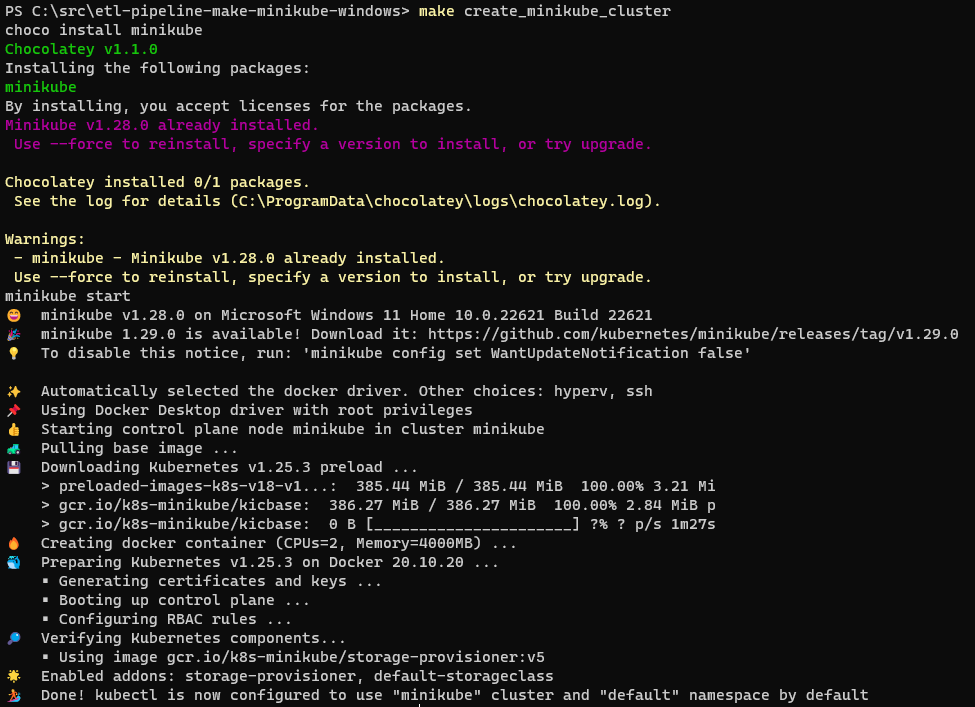
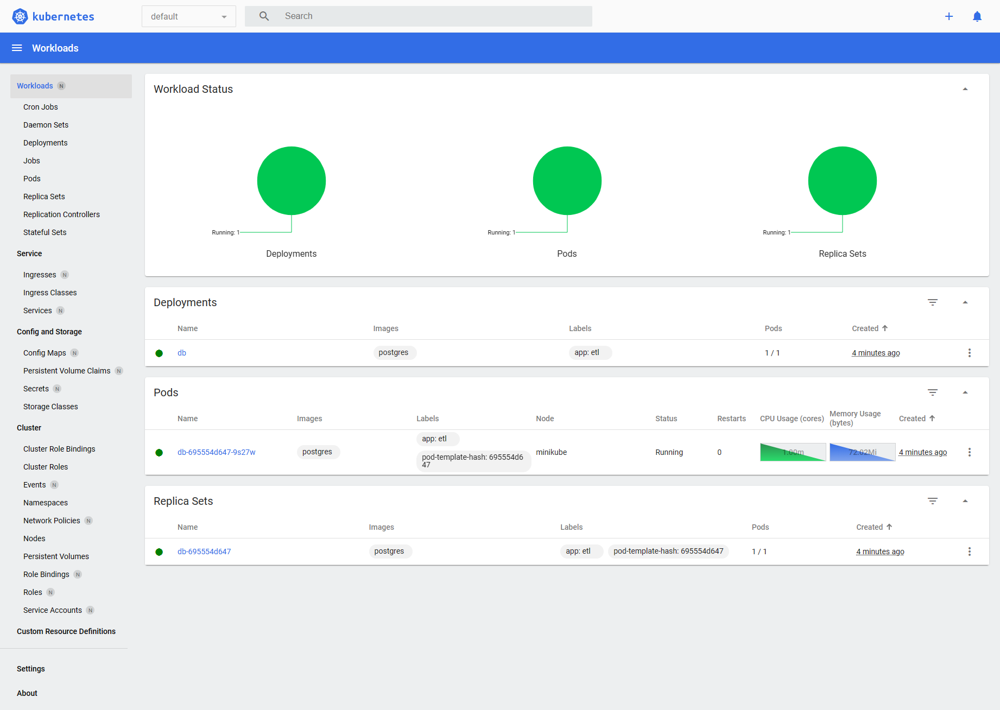
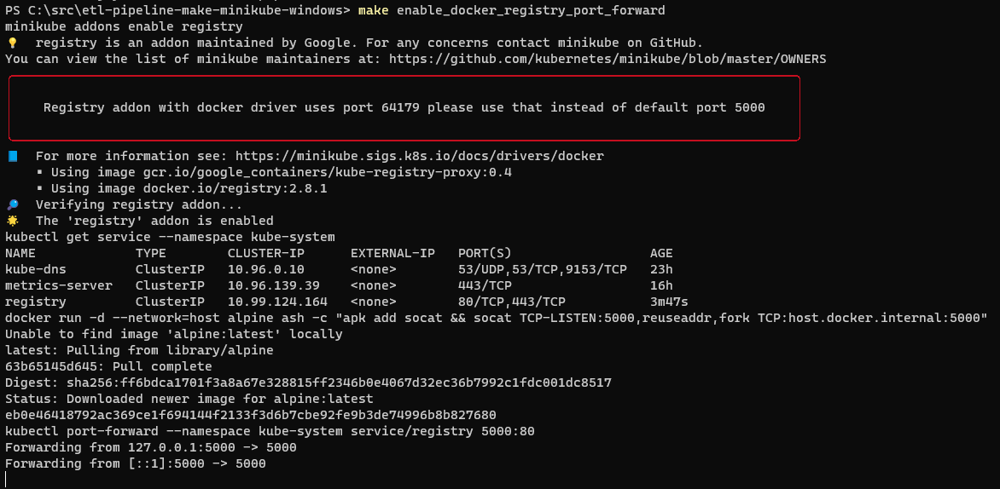
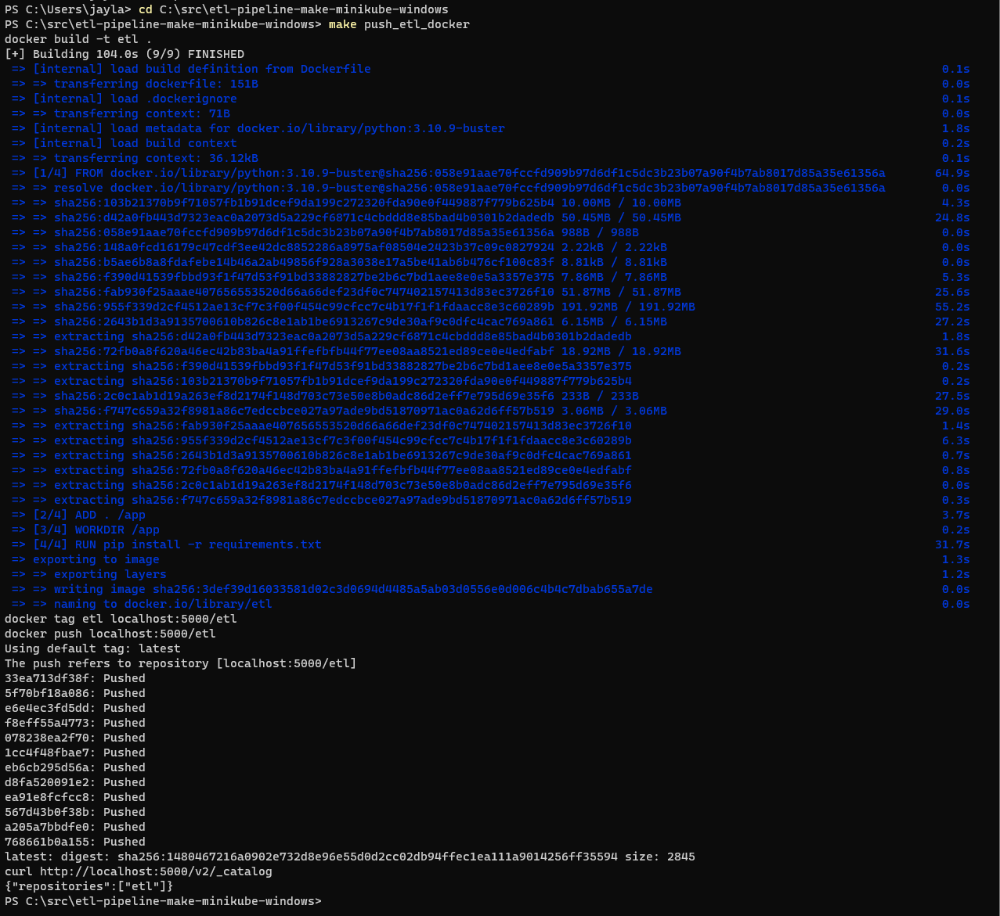

# The ETL

The steps to setup all the infrastructure needed and then run an ETL pipeline

## Definitions

### Kubernetes = K8s

### Pod: 
* A unit of work; the smallest and simplest K8s object. 
* Typically, a pod is set up to run a single container.
* A way to describe a series of containers, the volumes they might share, and interconnections that those containers within the pod may need. 
* Gives ability to migrate an application live from one version to another version without having downtime

<br>


### Deployment:
* Provides a means of changing or modifying the state of a pod, which may be one or more containers that are running, or a group of duplicate pods, known as ReplicaSets. 
* Deployments define how applications will run they do not guarantee where applications will live within the cluster. 

<br>

### Service: 
* A Kubernetes service is a logical abstraction for a deployed group of pods in a cluster (which all perform the same function). Since pods are ephemeral, a service enables a group of pods, which provide specific functions (web services, image processing, etc.) to be assigned a name and unique IP address (clusterIP).

<br>

### Deployments and Services are often used in tandem
* Deployments define the desired state of the application.
* Services make sure communication between almost any kind of resource and the rest of the cluster is stable and adaptable. 

<br>

## Getting Started

These instructions will get you a copy of the project up and running on your local machine for demonstration and testing purposes. 

<br>

### Prerequisites
* Running on a Windows11 host
* git is installed 
* docker is installed and running

<br>

### Installing

A step by step series of examples that tell you how to get the environment running

<br>

0. Open a powershell terminal and clone the repository

    Run the following commands:
    ```powershell
    mkdir -p c:\src; cd c:\src
    git clone https://github.com/jazzlyj/etl-pipeline-make-minikube-windows.git
    cd etl-pipeline-make-minikube-windows
    ```
    
<br>

*NOTE: Open a powershell as administrator.*
    
Be sure to run the following steps from that or an additional admin priveleged powershell

1. Install the Chocolatey software package manager for Windows

    Run the following command:

    ```powershell
    Set-ExecutionPolicy Bypass -Scope Process -Force; [System.Net.ServicePointManager]::SecurityProtocol = [System.Net.ServicePointManager]::SecurityProtocol -bor 3072; iex ((New-Object System.Net.WebClient).DownloadString('https://community.chocolatey.org/install.ps1'))
    ```
    
<br>

2. Using Chocolatey install Make the build automation tool being

    Run the following command:


    ```powershell
    choco install make
    ```
    
<br>

3. Install Minikube and start the Kubernetes (K8s) cluster

<br>
What is Minikube:

"Minikube quickly sets up a local Kubernetes cluster"

Source: [Minikube](https://minikube.sigs.k8s.io/docs/)

<br>

Why Minikube (vs Docker Swarm or KIND)?

"
Minikube is a mature solution available for all major operating systems. Its main advantage is that it provides a unified way of working with a local Kubernetes cluster regardless of the operating system. It is perfect for people that are using multiple OS machines and have some basic familiarity with Kubernetes and Docker.

Pros:
* Mature solution
* Works on Windows (any version and edition), Mac, and Linux
* Multiple drivers that can match any environment
* Can work with or without an intermediate VM on Linux (vmdriver=none)
* Installs several plugins (such as dashboard) by default
* Very flexible on installation requirements and upgrades
"

[Source location](https://medium.com/containers-101/local-kubernetes-for-windows-minikube-vs-docker-desktop-25a1c6d3b766) 


<br>
<br>

In this step:
* Install Minikube
* Start Minikube

 <br>

* The make target contents:

    The make target of *create_minikube_cluster* has a dependency of the target *install_minikube*. There by giving a convenient way of both first installing minikube and then starting the K8s cluster.

    ```makefile
    install_minikube:
    	choco install minikube
    
    create_minikube_cluster: install_minikube
    	minikube start
    ```
    
* Run the make target:

(To install and start minikube)

*NOTE: Make sure docker is running*

```powershell
make create_minikube_cluster
```

<br>

* What it looks like:

  

<br>


3. Setup secrets in the Kubernetes (K8s) cluster

<br>

* Create a file in the dir called *credentials.txt* with the keys:
    ``` 
    DBHost=
    DBUser=
    DBPassword=
    DBPort=
    DBSchema=
    ```
    Be sure to set the values 
      
    NOTE: Do NOT store this file in git  


<br>
<br>

In this step:
* Create secrets the imperative way using (--from-env-file) 

 <br>

* The make target contents:


    ```makefile
    create_secrets: 
    	kubectl create secret generic pg-secret --from-env-file=./credentials.txt
    ```
    
* Run the make target:

    ```powershell
    make create_secrets
    ```
    
<br>

* What it looks like:

    

<br>

* Examine secrets with the command
    ```bash
    kubectl get secret pg-secret -o yaml
    apiVersion: v1
    data:
      DBHost: --------
      DBPassword: --------
      DBPort: ---------
      DBSchema: ---------
      DBUser: ----------
    kind: Secret
    metadata:
      creationTimestamp: "2023-03-21T04:25:28Z"
      name: pg-secret
      namespace: default
      resourceVersion: "12306"
      uid: --------------------
    type: Opaque
    ```
    


4. Create permanent storage, a means to access the permanent storage, install and configure Postgres (PG) DB.

    In this step:
* Configure a permanent storage resource in K8s. In this case for the Postgres DB server. This is required to allow data written into the PG DB to persist if and when the PG DB server K8s pods go down for any reason. Persistant storage is setup by creating two K8s resources:
    * Persistent Volume (PV) - [are volume plugins like Volumes, but have a lifecycle independent of any individual Pod that uses the PV](https://kubernetes.io/docs/concepts/storage/persistent-volumes/)
    * Persistent Volume Claim (PVC) - [is a request for storage by a user. It is similar to a Pod. Pods consume node resources and PVCs consume PV resources.]((https://kubernetes.io/docs/concepts/storage/persistent-volumes/)) 
* Deploy a PG DB server to store the data the ETL transforms and then loads. The deployment includes the PV noted above.
* Configure a service for the DB server deployment which is used by other K8s workloads to communicate with the DB server.

<br>


db-data-persistentvolumeclaim.yaml:
```yml
apiVersion: v1
kind: PersistentVolumeClaim
metadata:
  labels:
    app: etl
  name: db-data
spec:
  accessModes:
    - ReadWriteOnce
  resources:
    requests:
      storage: 1000Mi
```

db-deployment.yaml:

NOTE: the deployment contains critical pieces of information and actions such as:
* Environment variables needed to initialize the PG DB server
* Execution of shell command that logs into the default PG DB and creates a table
* Bind a mount (path) to the persistent volume claim where the PG DB data will be written permanently 
```yml
apiVersion: apps/v1
kind: Deployment
metadata:
  labels:
    app: etl
  name: db
spec:
  replicas: 1
  selector:
    matchLabels:
      app: etl
  strategy:
    type: Recreate
  template:
    metadata:
      labels:
        app: etl
    spec:
      containers:
        - env:
            - name: PGDATA
              value: /var/lib/postgresql/data
            - name: POSTGRES_DB
              valueFrom:
                secretKeyRef:
                    name: pg-secret
                    key: DBHost
            - name: POSTGRES_PASSWORD
              valueFrom:
                secretKeyRef:
                    name: pg-secret
                    key: DBPassword
            - name: POSTGRES_USER
              valueFrom:
                secretKeyRef:
                    name: pg-secret
                    key: DBUser
          image: postgres
          lifecycle:
            postStart:
              exec:
                command: ["/bin/sh","-c","sleep 20 && PGPASSWORD=$POSTGRES_PASSWORD psql -w -d $POSTGRES_DB -U $POSTGRES_USER -c 'CREATE TABLE IF NOT EXISTS gendercounts (id SERIAL PRIMARY KEY,gender TEXT, count INT4);'"]
          name: db
          ports:
            - containerPort: 5432
          resources: {}
          volumeMounts:
            - mountPath: /var/lib/postgresql/data
              name: db-data
      restartPolicy: Always
      volumes:
        - name: db-data
          persistentVolumeClaim:
            claimName: db-data
```

db-service.yaml:

NOTE: The K8s service defines critical pieces of information on how to reach the DB server (deployment), on what port and if this service is reachable from outside of the K8s cluster (loadBalancer vs nodePort).

```yml
apiVersion: v1
kind: Service
metadata:
  labels:
    app: etl
  name: db
spec:
  ports:
    - name: "5432"
      port: 5432
      targetPort: 5432
  selector:
    app: etl
status:
  loadBalancer: {}
```

<br>


* The make target contents:

    Using the *kubectl* command several K8s configuration, deployment and service yamls (detailed above) are applied. 
    ```makefile
    deploy_postgres:
    	kubectl apply -f db-data-persistentvolumeclaim.yaml
    	kubectl apply -f db-deployment.yaml
    	kubectl apply -f db-service.yaml
    ```
    

<br>

* Run the make target:
    ```powershell
    make deploy_postgres
    ```
    
<br>


* What it looks like:

    

<br>


5. Configure and open the Minikube dashboard

      In this step: 
* Configure Minikube with additional plugins for metrics gathering used/displayed by the dashboard 
* Start the dashboard (launches a browser window to the dashboard UI)


<br>

* The make target contents:
    ```makefile
    launch_minikube_dashboard:
    	minikube addons enable metrics-server
    	minikube dashboard
    ```
    
<br>

* Run the make target:
    ```powershell
    make launch_minikube_dashboard
    ```
    
<br>


* What it looks like:

    

    


<br>


*NOTE: Open an additional powershell (tab or window) as administrator.*

6. Install and setup a Docker registry to store created docker images 

    Minikube has a native capability to create a registry to store container images.

    It also simplifies the setup and configuration required for the end user so that the reqistry and its network are able to communicate with the K8s networks.

    Docker desktop or KIND would require additional configuration.

    In this step:
    * Configure Minikube with the docker registry plugin  
    * Pull the image and run the docker registry container
    * Check to make sure the registry is up and running
    * Enable port forwarding so images can be pushed to this local registry
    
<br>

* The make target contents:

    * The make target of *enable_docker_registry_port_forward* has a dependency of the target *enable_docker_registry*. Again giving a convenient way two perform steps in one command.
    ```makefile
    enable_docker_registry:
    	minikube addons enable registry 
    	kubectl get service --namespace kube-system
    
    enable_docker_registry_port_forward: create_docker_registry
    	kubectl port-forward --namespace kube-system service/registry 5000:80
    ```
    
<br>

* Run the make target:
    ```powershell
    cd c:\src\etl-pipeline-make-minikube-windows
    make enable_docker_registry_port_forward
    ```
    
<br>


* What it looks like:

    


<br>


<br>
7. Build the ETL docker container image, push the image to the registry, and deploy the image to the K8s cluster

In this step:
* Build the "etl" docker image and tag it
  * [12 factor app](https://12factor.net) software design default practices number 3 (store config in the env) as well as [SOLID](https://en.wikipedia.org/wiki/SOLID) principles, *Dependency Inversion Principle*. 
  Env vars (config) are injected by importing *connector.py* and a higher level function uses lower level components (the various database connections and other interfaces). 
  Arguably SOLID principle, *Interface Segregation* and *Single Responsibility* are employed
* Push the "etl" docker image to the local docker registry
* Confirm the image is present in the registry


etl dockerfile:

```dockerfile
FROM python:3.10.9-buster
ADD . /app
WORKDIR /app
RUN pip install -r requirements.txt
CMD ["python", "etl.py"]
```


<br>

* The make target contents:
    * The make target of *create_etl_docker* has a dependency of the target *push_etl_docker*. Again giving a convenient way two perform steps in one command.

    ```makefile
    create_etl_docker:
    	docker build -t etl .
    	docker tag etl localhost:5000/etl
    
    push_etl_docker: create_etl_docker
    	docker push localhost:5000/etl
    	curl http://localhost:5000/v2/_catalog
    ```
    


<br>

* Run the make target:
    ```powershell
    cd c:\src\etl-pipeline-make-minikube-windows
    make push_etl_docker
    ```
    
<br>

* What it looks like:

    


<br>


<br>
8. Deploy etl docker container

In this step :
* Deploy the etl application in K8s


etl-deployment.yaml:

NOTE: the image config item telling K8s where to find the docker container image to start. As well as the env vars using the secret (pg-secret) needed to interface with the PG DB server.

```yml
apiVersion: apps/v1
kind: Deployment
metadata:
  labels: 
    app: etl
  name: etl
spec:
  replicas: 1
  selector:
    matchLabels:
      app: etl
  template:
    metadata:
      labels:
        app: etl
    spec:
      containers:
        - env:
          - name: DATABASE_HOST
            valueFrom:
              secretKeyRef:
                name: pg-secret
                key: DBHost
          - name: DATABASE_USER
            valueFrom:
              secretKeyRef:
                name: pg-secret
                key: DBUser
          - name: DATABASE_PASSWORD
            valueFrom:
              secretKeyRef:
                name: pg-secret
                key: DBPassword
          - name: DATABASE_NAME
            valueFrom:
              secretKeyRef:
                name: pg-secret
                key: DBSchema
          - name: DATABASE_PORT
            valueFrom:
              secretKeyRef:
                name: pg-secret
                key: DBPort
          resources: {}  
          image: localhost:5000/etl
          name: etl
```


<br>

* The make target contents:
    ```makefile
    deploy_etl_docker:
    	kubectl apply -f etl-deployment.yaml
    ```
    


<br>

* Run the make target:
    ```powershell
    make deploy_etl_docker
    ```
    
<br>


* What it looks like:

    

<br>

<br>

<br>


99. Tear down and cleanup; remove all parts of the infrastructure

* Run the make target
    ```powershell
    make delete_minikube_cluster
    ```
    
<br>
<br>

## Built With

* [Choclately](https://chocolatey.org/) - Software management solution for Windows
* [Docker](https://www.docker.com/products/personal/) - OS-level virtualization to deliver software in packages called containers
* [Make](https://www.gnu.org/software/make/) - Build automation tool
* [Minikube](https://minikube.sigs.k8s.io/docs/) - Kubernetes cluster (in a box)
* [Postgres](https://www.postgresql.org/) - Postgres Relational Database
* [Python](https://www.python.org/) - Python programming language


<br>
<br>

## Authors

[Jay Lavine](https://github.com/jazzlyj)

<br>
<br>

## Acknowledgments

* Cited inline 